# GALLA

### Aapka udhaar, wapas aapke galla mein.

**An agentic AI back-office that turns a kirana merchant's informal udhaar book into recovered cash and lender-ready credit history.**

Built by **Team Spy** for **HackSprint** (24-hour hackathon, MAHE) · **Track 1 — FinTech & Smart Commerce (PS21)**.

> **Prototype.** The merchant, customers and transactions are simulated demo data. GALLA never lends, holds or moves real money. UPI payments run on a payment gateway's **staging** environment with test money only.

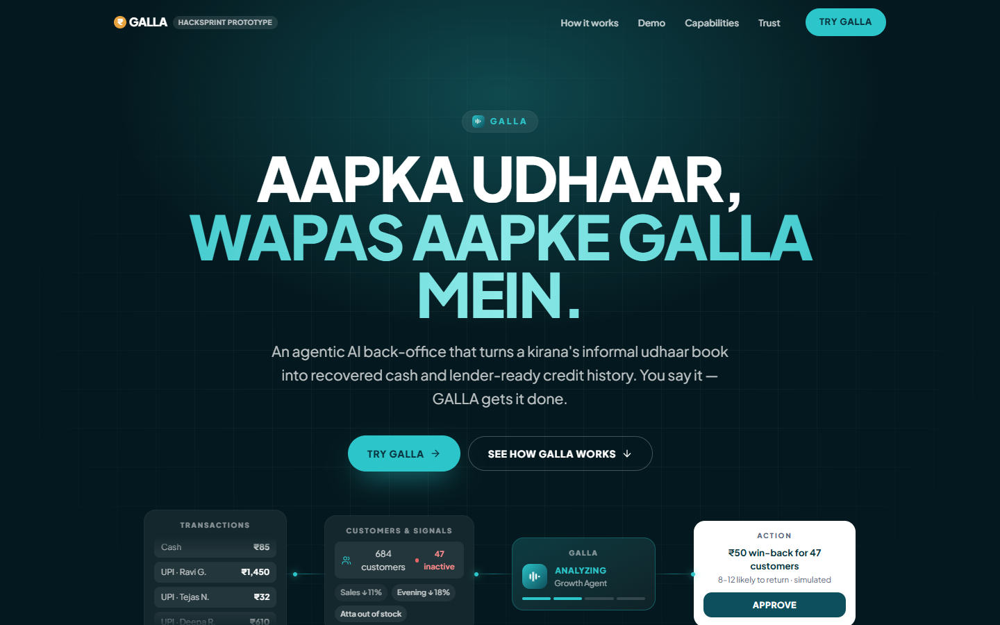

---

## The problem

- **~13 million kiranas** form the backbone of India's retail and FMCG distribution.
- **Udhaar lives in notebooks.** Asking neighbours for money is awkward, so dues get delayed or forgotten.
- **Credit-invisible.** Good repayment behaviour leaves no record, so the merchant never gets formal working capital.

## How GALLA solves it

| Step | Feature | What happens |
| --- | --- | --- |
| 1 · **Capture** | **Voice Khata** | The merchant says *"Ramesh 450 udhaar, Friday tak"*. GALLA logs it and sends the customer a digital receipt. |
| 2 · **Recover** | **AI Recovery Calls** | Polite, consent-based calls in Kannada, Hindi or English. The agent negotiates a part-payment, then sends a UPI pay-link on WhatsApp. |
| 3 · **Grow** | **Credit Readiness Passport** | Clean repayment and UPI inflows become an explainable READY / ALMOST READY / NEEDS IMPROVEMENT score a lender can trust. |

**Measurable value:** ₹ udhaar recovered · days-to-recover ↓ · working capital freed · credit readiness ↑

---

## Features

### Udhaar Khata (`/app#/udhaar`, or Business → Udhaar Khata)
- **Voice Khata.** Log udhaar or repayments by voice (Sarvam STT) or text in English, Hindi or Kannada phrasing: *"Deepa 300 udhaar kal tak"*, *"Lakshmi ne 500 diya"*. A deterministic parser picks out the name, amount and due day, so it also works offline.
- **AI Recovery Calls.** A scripted live call in Kannada, Hindi or English. The customer offers a part-payment, the agent accepts and sends a UPI link. Repayments are recorded as payments and appear on Home, the QR tab and in the action history.
- **Customer Trust Score.** A GREEN / AMBER / RED tag, a safe credit limit and a next action for every udhaar customer.
- **Guardrails.** Calls only between 9 am and 8 pm, at most 2 reminders a week, opt-in required, opt-out honoured, every call logged.
- **Win-back Offers.** Customers who clear their dues can get a ₹20 loyalty offer.
- **Daily Galla Report.** An evening voice note covering recovered, outstanding, passport score and who to follow up with.
- **Fake Payment Shield** *(beta)*. Checks a customer's "paid" screenshot claim against real recorded UPI credits.
- **Bazaar Pulse** *(beta)*. An anonymous benchmark: *"Shops like yours recover 70% in 7 days. You: X%."*
- **Galla Box (hardware).** A counter soundbox that announces repayments, shows dues on an OLED, and has a push-to-talk button for Voice Khata. See [Hardware](#hardware-galla-box).

### GALLA AI teammate (existing capabilities)
- **Command center.** Ask anything by voice or text in Kannada, Kanglish, Hindi, Hinglish or English. Answers come with evidence, confidence and uncertainty.
- **Growth.** Finds why sales dropped, simulates win-back campaigns, and runs them only after the merchant approves.
- **Inventory.** Predicts stock-outs and prepares supplier orders.
- **Cashflow guardian.** Shows available vs committed money and predicts UPI mandate failures.
- **Safety.** A QR and beneficiary risk check with nine explainable signals.
- **Credit Readiness Passport.** A score with reasons and concrete improvements. Lenders decide; GALLA never approves loans.
- **Documents and catalog.** Invoice extraction to stock updates, and a voice-to-digital catalog.
- **UPI test payments.** Collect a real staging payment from the QR tab, verified server-side.
- **Learning loop.** Every action is audited, and campaign results feed back into future estimates.

---

## Hardware: Galla Box

The **Galla Box** is GALLA's counter device, a small soundbox that sits next to the cash drawer (the *galla*):

- **Speaks every repayment.** When a UPI repayment is verified, it announces *"Galla mein paanch sau pachaas rupaye praapt hue"* and the LED flashes green.
- **Shows the khata at a glance.** A 0.96" OLED screen shows outstanding udhaar and money recovered this week. The LED turns amber while any customer is overdue.
- **Push-to-talk khata.** The merchant presses the big button, speaks an entry like *"Ramesh 450 udhaar, Friday tak"*, and presses again to finish, without unlocking a phone.

The web app connects to the box over **USB using the Web Serial API** (Chrome or Edge on desktop): open **Business → Udhaar Khata → Galla Box → Connect via USB**. With no device plugged in, **Use simulator** runs the same protocol on screen and speaks the announcements through the browser.

### Hardware architecture

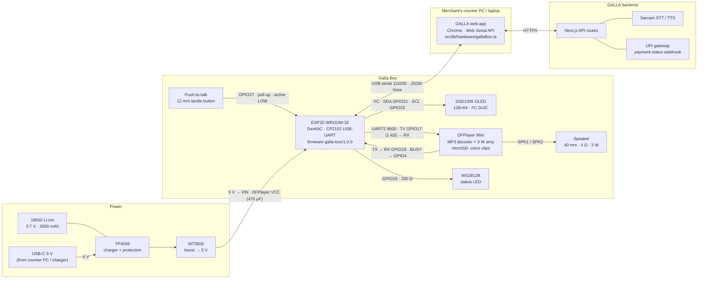

**Repayment announcement, end to end**

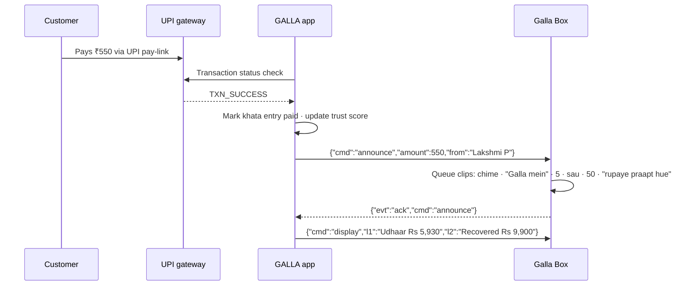

### Pin map (ESP32 DevKitC)

| ESP32 pin | Connects to | Notes |
| --- | --- | --- |
| GPIO21 / GPIO22 | OLED SDA / SCL | I²C, address `0x3C` |
| GPIO17 (TX2) | DFPlayer RX | Through a 1 kΩ resistor to cut noise |
| GPIO16 (RX2) | DFPlayer TX | 9600 baud |
| GPIO4 | DFPlayer BUSY | LOW while a clip plays; used to chain clips |
| GPIO27 | Push-to-talk button → GND | Internal pull-up, 30 ms debounce |
| GPIO25 | WS2812B DIN | Through 330 Ω |
| VIN / GND | 5 V rail from MT3608 or USB | Common ground for all modules |
| USB (CP2102) | Counter PC | Serial link to the web app, 115200 baud |

### Bill of materials

| Part | Qty | Approx. cost |
| --- | --- | --- |
| ESP32-WROOM-32 DevKitC (CP2102) | 1 | ₹450 |
| SSD1306 0.96" OLED, I²C | 1 | ₹180 |
| DFPlayer Mini + 8 GB microSD | 1 | ₹370 |
| 40 mm 4 Ω 3 W speaker | 1 | ₹60 |
| 12 mm tactile push button, WS2812B LED | 1 each | ₹35 |
| 18650 cell + TP4056 USB-C charger + MT3608 boost | 1 each | ₹330 |
| 470 µF capacitor, 1 kΩ and 330 Ω resistors, slide switch, wires | — | ₹50 |
| 3D-printed PLA enclosure | 1 | ₹300 |
| **Total** | | **≈ ₹1,775** |

### Serial protocol

Newline-delimited JSON at 115200 baud, in both directions.

| Direction | Message | Meaning |
| --- | --- | --- |
| App → box | `{"cmd":"ping"}` | Ask the box to identify itself |
| App → box | `{"cmd":"display","l1":"…","l2":"…"}` | Two 21-character OLED lines (the OLED font has no ₹, so the app sends "Rs") |
| App → box | `{"cmd":"led","color":"green\|amber\|red\|off"}` | Status LED |
| App → box | `{"cmd":"announce","amount":550,"from":"Lakshmi P"}` | Speak a received payment |
| Box → app | `{"evt":"hello","fw":"galla-box/1.0.0","id":"…"}` | Sent on boot and in reply to `ping` |
| Box → app | `{"evt":"ptt","state":"down\|up"}` | Push-to-talk pressed or released; each press starts or stops a Voice Khata recording |
| Box → app | `{"evt":"ack","cmd":"…"}` / `{"evt":"error","msg":"…"}` | Command result |

### Build and flash

1. Wire the parts as in the pin map. Keep the 470 µF capacitor close to the DFPlayer's VCC pin, because the amplifier draws current peaks at high volume.
2. Copy the voice clips to the microSD as `/mp3/0001.mp3` … `/mp3/0105.mp3`. The clip list is at the top of [`hardware/galla-box/galla-box.ino`](hardware/galla-box/galla-box.ino).
3. In Arduino IDE, install the **esp32** board package and the libraries *Adafruit SSD1306*, *Adafruit GFX*, *Adafruit NeoPixel*, *DFRobotDFPlayerMini* and *ArduinoJson* (v7).
4. Select **ESP32 Dev Module**, open `hardware/galla-box/galla-box.ino` and upload.
5. Open GALLA in Chrome → **Udhaar Khata → Galla Box → Connect via USB**, and pick the CP2102 port.

---

## Screenshots

| Udhaar Khata | Voice Khata: new entry logged |
| --- | --- |
| 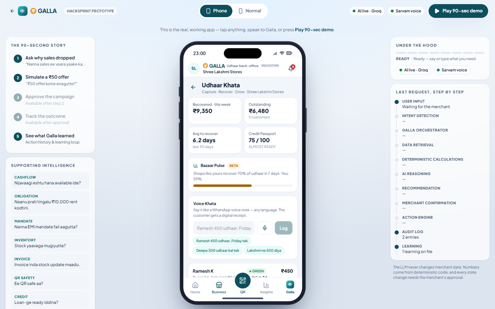 | 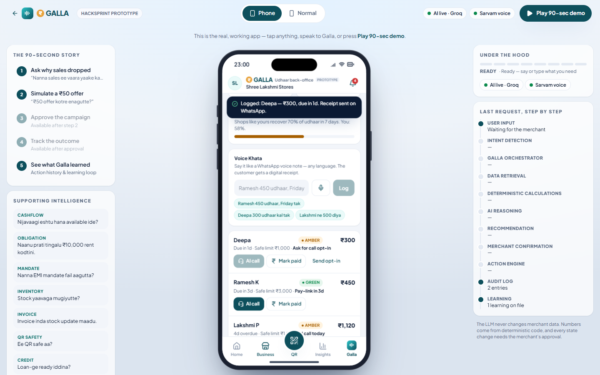 |
| **AI recovery call (Kannada)** | **Credit Readiness Passport** |
| 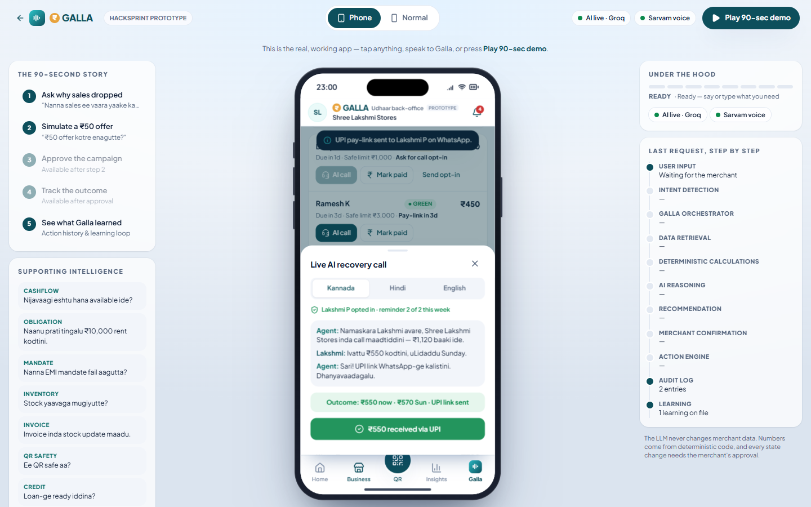 | 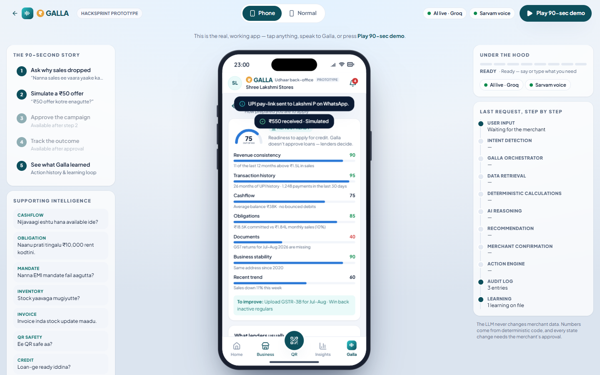 |
| **Galla Box (hardware, simulator)** | **GALLA AI teammate** |
| 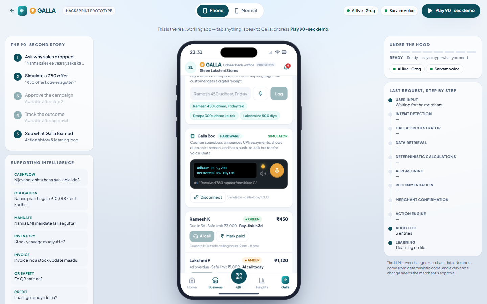 | 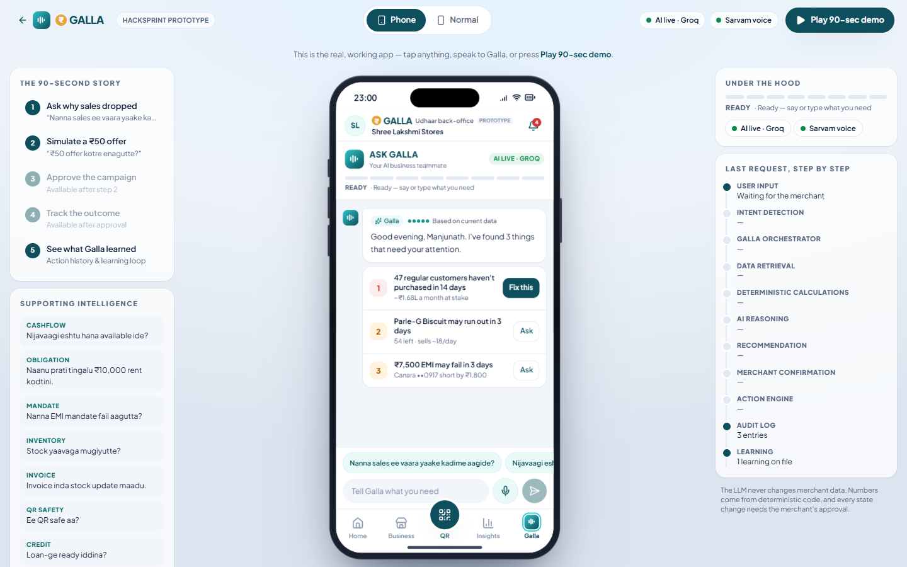 |
| **Home** | **Capabilities (landing)** |
| 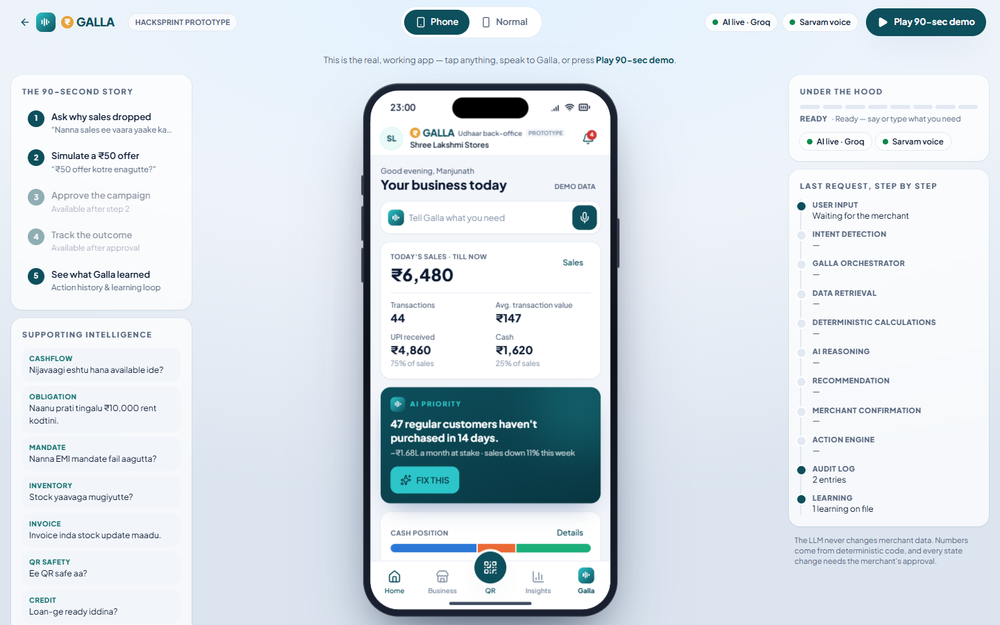 | 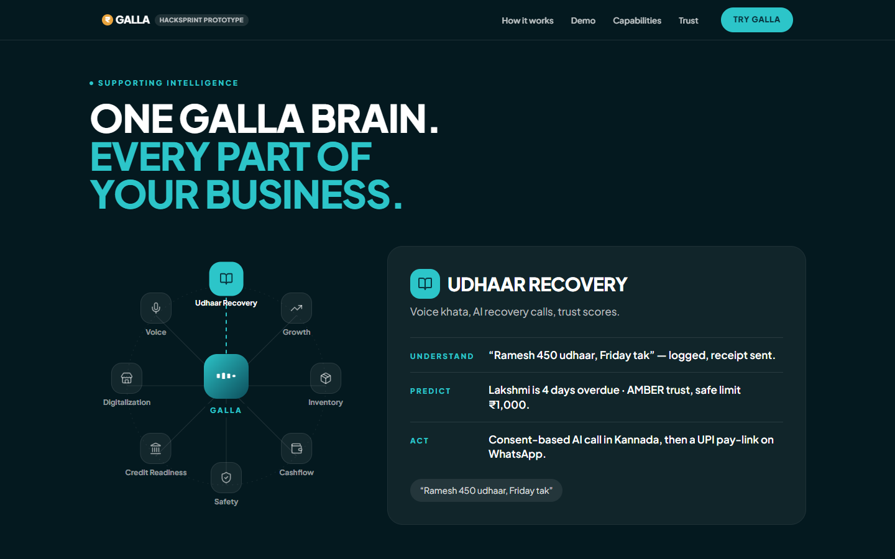 |
| **Mobile** | |
| 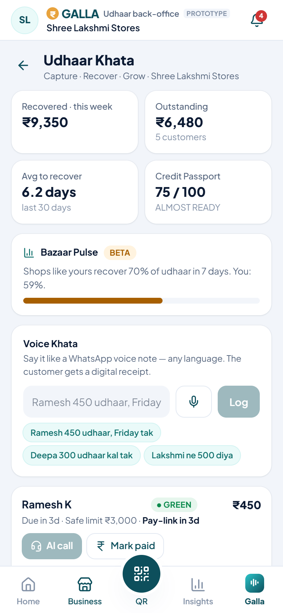 | |

---

## Architecture

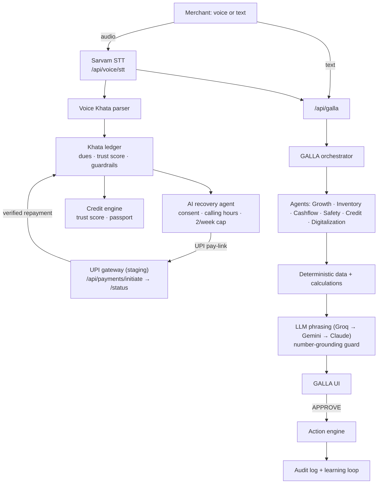

**Principles**
- **AI vs deterministic, clearly separated.** The LLM handles intent, language and explanation. Money, scores, dates and every state change are plain TypeScript.
- **Grounded answers.** `src/lib/ai/guard.ts` rejects any LLM reply that contains a number not present in the agent's facts.
- **Approval before action.** Agents only propose. The action engine executes after the merchant approves and records an audit entry.
- **Never breaks in a demo.** Without API keys, everything falls back to deterministic answers, simulated voice and simulated payments.

## Tech stack

| Area | Choice |
| --- | --- |
| Framework | Next.js 15 (App Router), React 19, TypeScript |
| Styling & motion | Tailwind CSS v4, Framer Motion, Lucide icons |
| Charts | Recharts |
| Language models | Groq (primary), Google Gemini (fallback + vision), Anthropic Claude (optional) |
| Speech | Sarvam AI (STT + TTS) |
| Payments | Paytm Payment Gateway **staging** (UPI test money), official `paytmchecksum` |
| Validation | Zod |
| Hardware | ESP32 (Arduino), SSD1306 OLED, DFPlayer Mini, Web Serial API |

---

## Getting started

Requires **Node.js 20+**. All API keys are optional; the app works fully in demo mode.

```bash
git clone https://github.com/yadavahc/Hacksprint.git
cd Hacksprint
npm install
cp .env.example .env.local   # fill in any keys you have (all optional)
npm run dev                  # http://localhost:3000
```

Production build: `npm run build && npm start`.

### Routes

| Route | What it is |
| --- | --- |
| `/` | Landing page |
| `/app` | Live application (Phone ↔ Normal presentation modes) |
| `/app#/udhaar` | Udhaar Khata: voice khata, AI recovery calls, trust scores |
| `/app#/galla`, `/app#/qr`, … | Deep link to any screen |
| `/demo` | Live application that auto-plays the 90-second story |

### Environment variables

Keys are only read in server route handlers. `GET /api/health` reports which capabilities are active.

| Variable | Enables |
| --- | --- |
| `GROQ_API_KEY`, `GROQ_MODEL` | Primary language model |
| `GEMINI_API_KEY`, `GEMINI_TEXT_MODEL`, `GEMINI_VISION_MODEL` | Text fallback and document reading |
| `ANTHROPIC_API_KEY` | Optional further fallback |
| `SARVAM_API_KEY` | Live Indian-language speech-to-text and spoken replies |
| `PAYTM_MID`, `PAYTM_MERCHANT_KEY`, `PAYTM_ENV=staging` | Real UPI test payments (production is deliberately refused) |

---

## Demo script for judges

1. Open **`/app`** → **Business → Udhaar Khata**.
2. Tap the sample *"Ramesh 450 udhaar, Friday tak"* → **Log**. The entry appears and a receipt is sent.
3. On **Lakshmi P** (AMBER, 4 days overdue) tap **AI call** → **Start call** in Kannada. See the part-payment outcome and the UPI link, then tap **₹… received via UPI**. Recovered rises and the payment shows on Home and the QR tab.
4. Try **Fake Payment Shield** with a wrong amount; it refuses to confirm.
5. Tap **Play 30-second voice note** on the Daily Galla Report.
6. On the **Galla Box** card, tap **Connect via USB** (or **Use simulator**). Record a repayment and the box announces it; press the orange push-to-talk button to start a voice note.
7. Open **Credit Readiness** for the passport, then the **GALLA** tab and ask *"Nanna sales ee vaara yaake kadime aagide?"* for the AI teammate flow.
8. Or open **`/demo`** to let the full story play itself.

## API reference

| Method & route | Body | Returns |
| --- | --- | --- |
| `GET /api/health` | — | Active capabilities |
| `POST /api/galla` | `{ text, preferredLanguage, forceDemo, context }` | Structured agent response |
| `POST /api/voice/stt` | `multipart/form-data` `file` | `{ transcript, languageCode }` |
| `POST /api/voice/tts` | `{ text, language }` | `{ audio, mime }` |
| `POST /api/documents/extract` | `multipart/form-data` `file` | `{ extracted, engine }` |
| `POST /api/payments/initiate` | `{ amount, note? }` | `{ orderId, txnToken, amount, mid, scriptUrl }` |
| `POST /api/payments/status` | `{ orderId }` | `{ status, code, message, txnId?, paymentMode? }` |

A payment only counts when the gateway's own Transaction Status API returns `TXN_SUCCESS`. The browser's result alone is never trusted.

## Project structure

```
hardware/galla-box/    ESP32 firmware for the Galla Box
src/
  app/                  Landing, /app, /demo, API routes (galla · health · voice · documents · payments)
  components/
    udhaar/             Udhaar Khata: voice khata, recovery calls, trust, shield, daily report
    hardware/           Galla Box card (device panel) and app-wide payment announcer
    landing/            Landing page sections
    app-shell/          GallaApplication, screen registry, stage
    galla/ chat/ voice/ AI command center, cards, voice overlay
    home/ business/ customers/ inventory/ cashflow/ campaigns/ insights/
    safety/ credit/ documents/ catalog/ history/ settings/ payments/ demo/
    brand-header/ bottom-nav/ ui/
  lib/
    udhaar/             Khata ledger, voice-note parser, trust score, guardrails, call scripts
    hardware/           Galla Box Web Serial link, protocol and simulator
    agents/ ai/ data/ simulation/ risk/ cashflow/ inventory/ credit/ payments/ voice/ store/
```

## Trust, safety & compliance

- Customers opt in before any AI call and can opt out anytime.
- Calls only in allowed hours, capped per week, with no threats.
- GALLA never lends or holds money. UPI goes directly from customer to merchant.
- Data minimisation and consent logs, aligned with the DPDP Act.
- Credit readiness is guidance only. Lenders make every lending decision.

## Business model & roadmap

- **Freemium:** voice khata and reminders are free. **GALLA Pro ₹199/month:** AI calls, passport and Bazaar Pulse.
- **Lender referral fee:** only on consented, approved loans.
- **Roadmap:** 24h MVP → SMS / missed-call fallback → supplier pay-later → ONDC + Account Aggregator.
- **Pilot targets:** 30% faster udhaar recovery · 2 hrs saved per merchant per week · 50% reach a "ready" passport in 90 days.

---

*GALLA is a HackSprint prototype. All data is simulated; payments use test money only.*
